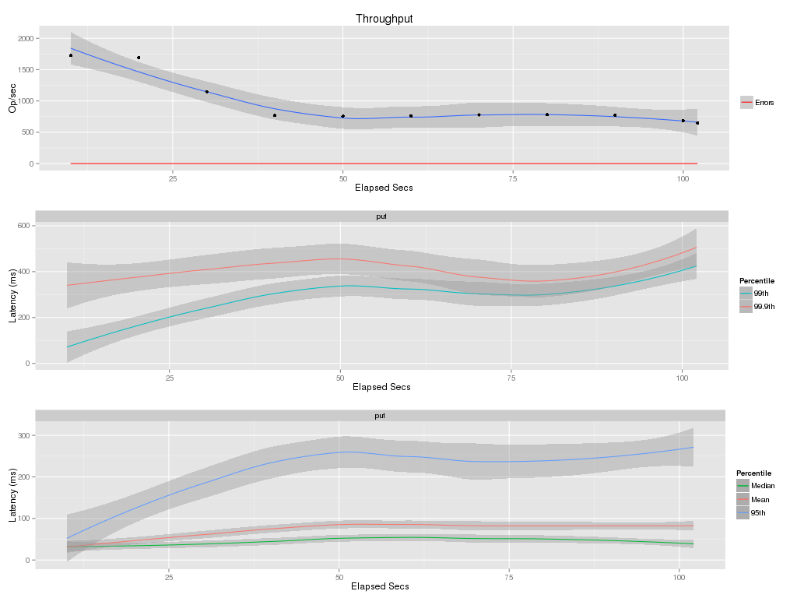
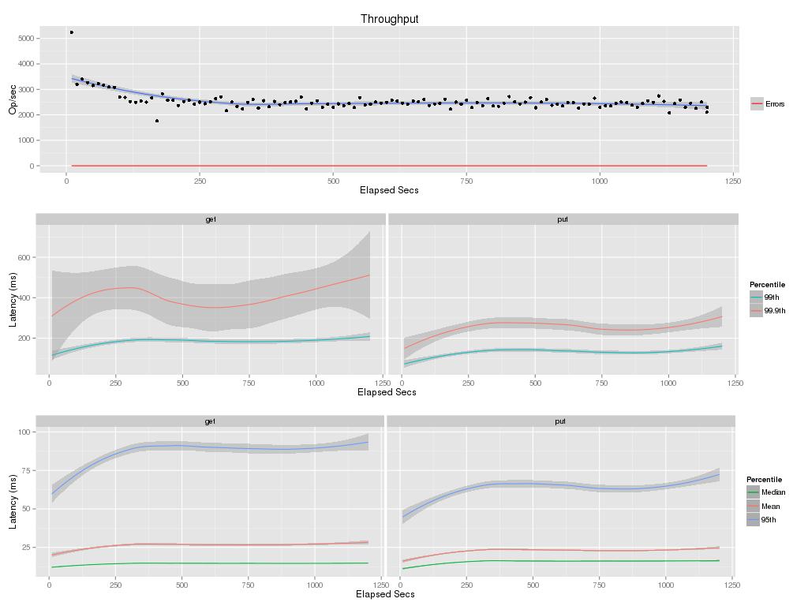
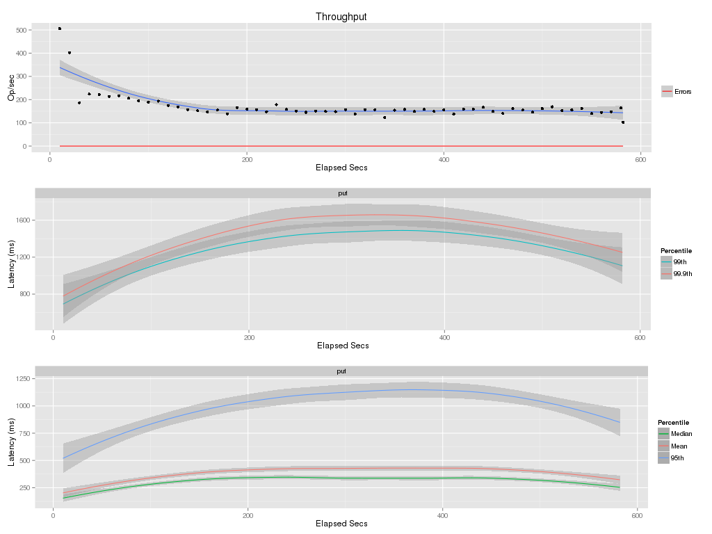
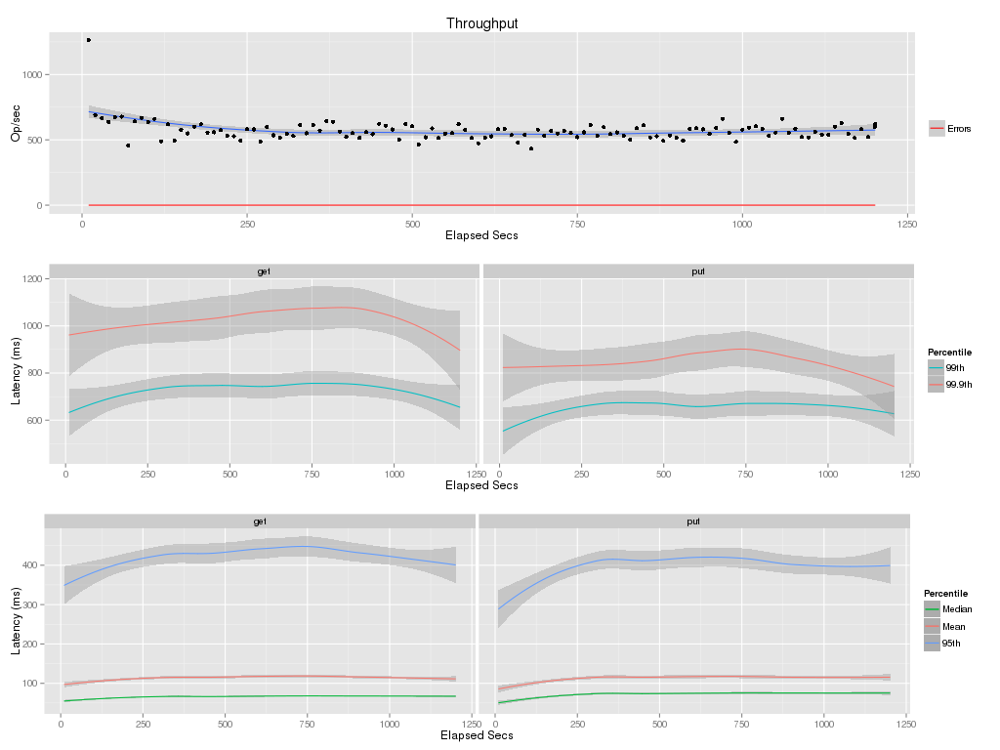

Title
=====

Benchmark result for leofs-1.0.0 with Multi DC Replication

Env
===

* bacho_bench (benchmarker)
    * Configuration:
        * key_generator:
            * type: pareto_int
            * max key: 100000
        * value_generator:
            * type: exponential_bin
            * min-size: 8192
            * mean-size: 131072 - 524288
        * [see more](128K_R8W2.conf, 512K_R8W2.conf etc...)

* LeoFS
    * OS: CentOS release 6.4 (Final)
    * Kernel: Linux intel11.rit.rakuten.com 2.6.32-358.6.2.el6.x86_64 #1 SMP Thu May 16 20:59:36 UTC 2013 x86_64 x86_64 x86_64 GNU/Linux
    * Erlang: R16B03-1
    * LeoFS:  1.0.0

* LeoFS cluster settings

```
    [System config]
                    System version : 1.0.0
                        Cluster Id : leofs_1
                             DC Id : dc_1
                    Total replicas : 2
               # of successes of R : 1
               # of successes of W : 1
               # of successes of D : 1
    # of DC-awareness replicas    : 1
    # of Rack-awareness replicas  : 0
                         ring size : 2^128
                 Current ring hash : e66e265a
                    Prev ring hash : e66e265a
    
    [Node(s) state]
    -------+-------------------------------+--------------+----------------+----------------+----------------------------
     type  |             node              |    state     |  current ring  |   prev ring    |          updated at         
    -------+-------------------------------+--------------+----------------+----------------+----------------------------
      S    | intel21@192.168.200.21        | running      | e66e265a       | e66e265a       | 2014-04-01 16:17:23 +0900
      S    | intel22@192.168.200.22        | running      | e66e265a       | e66e265a       | 2014-04-01 16:17:23 +0900
      G    | gateway_0@192.168.200.12      | running      | e66e265a       | e66e265a       | 2014-04-01 16:17:26 +0900
```

```
    [System config]
                    System version : 1.0.0
                        Cluster Id : leofs_2
                             DC Id : dc_2
                    Total replicas : 2
               # of successes of R : 1
               # of successes of W : 1
               # of successes of D : 1
    # of DC-awareness replicas    : 1
    # of Rack-awareness replicas  : 0
                         ring size : 2^128
                 Current ring hash : e706ec8d
                    Prev ring hash : e706ec8d
    
    [Node(s) state]
    -------+-------------------------------+--------------+----------------+----------------+----------------------------
     type  |             node              |    state     |  current ring  |   prev ring    |          updated at         
    -------+-------------------------------+--------------+----------------+----------------+----------------------------
      S    | intel25@192.168.200.25        | running      | e706ec8d       | e706ec8d       | 2014-04-01 16:21:27 +0900
      S    | intel26@192.168.200.26        | running      | e706ec8d       | e706ec8d       | 2014-04-01 16:21:27 +0900
      G    | gateway_0@192.168.200.24      | running      | e706ec8d       | e706ec8d       | 2014-04-01 16:21:29 +0900
```

Result
======
* Bulk Load with 128K

* Read:Write = 8:2 with 128K

* Bulk Load with 512K

* Read:Write = 8:2 with 512K


Conclusion
==========
We have acomplished implementing `Multi DC Replication` without degrade performance.
